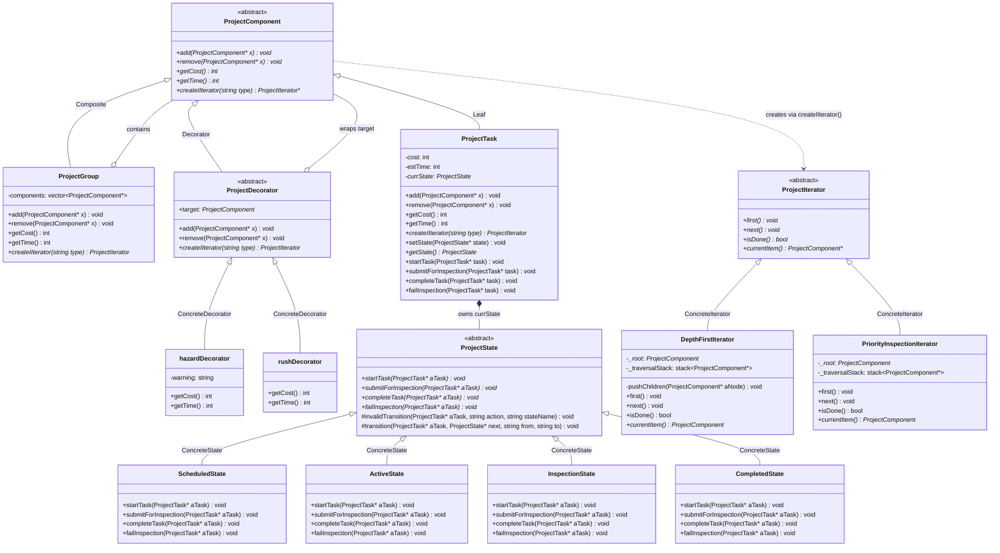
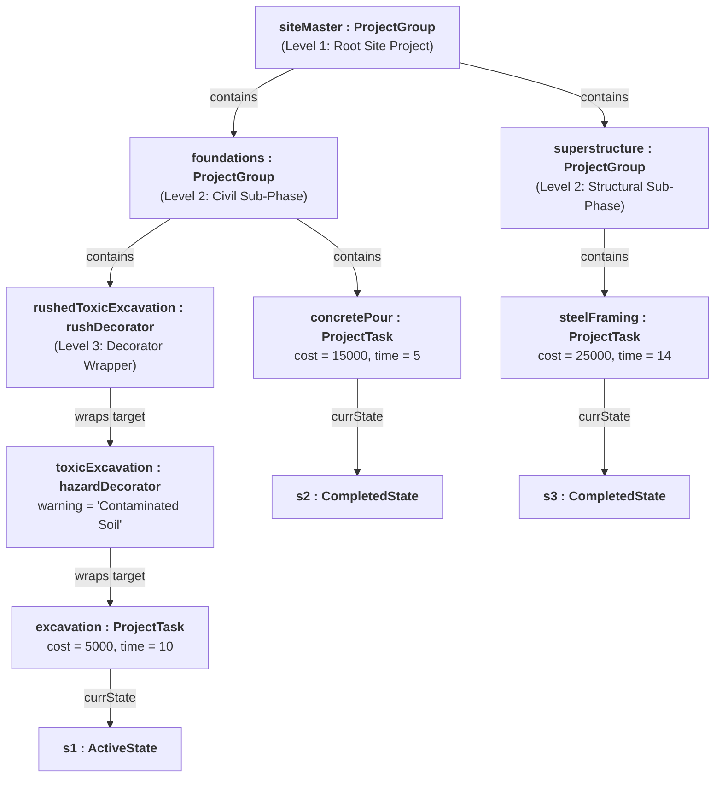
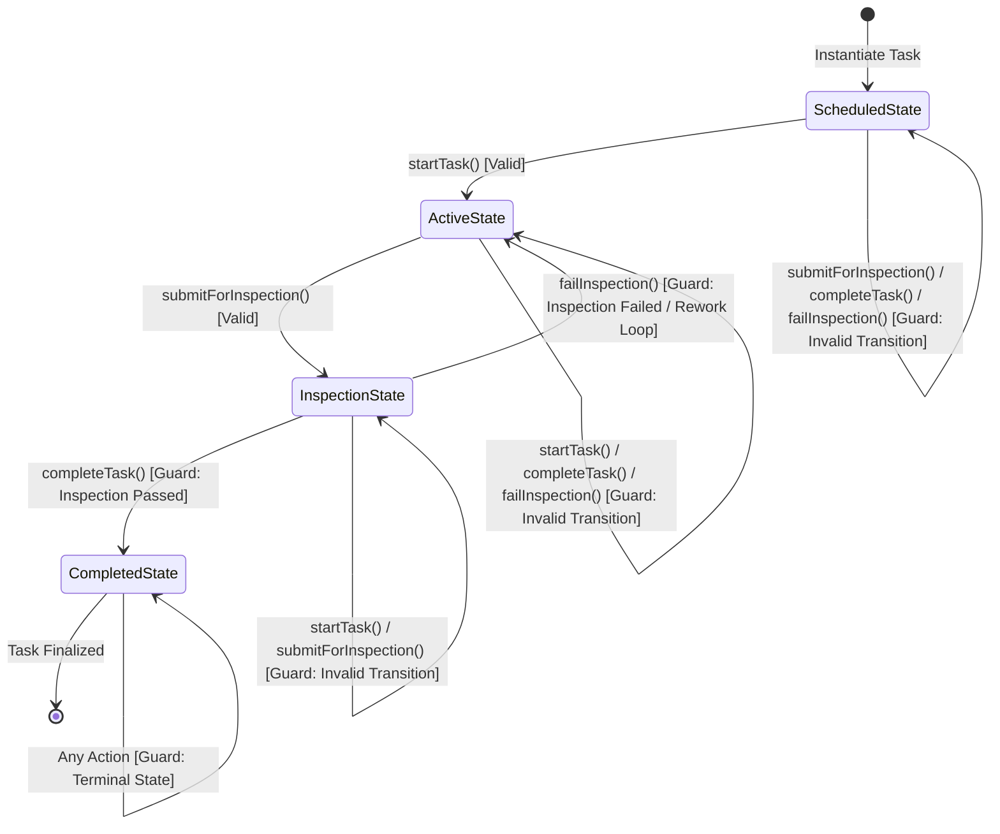

# TaskForge UML Diagram Portfolio

This document contains the complete UML diagram specifications for **TaskForge (Construction Site Domain)**. All diagrams are provided in both **Mermaid.js** and **PlantUML** formats for direct import and rendering in **Visual Paradigm**, GitHub Markdown, or Mermaid Live Editor.

---

## 1. Class Diagram

### GoF Design Pattern Participants:
- **Composite Pattern**:
  - `ProjectComponent` (Component)
  - `ProjectGroup` (Composite)
  - `ProjectTask` (Leaf)
- **Decorator Pattern**:
  - `ProjectComponent` (Component)
  - `ProjectDecorator` (Decorator)
  - `hazardDecorator` (ConcreteDecorator)
  - `rushDecorator` (ConcreteDecorator)
- **State Pattern**:
  - `ProjectTask` (Context)
  - `ProjectState` (State)
  - `ScheduledState`, `ActiveState`, `InspectionState`, `CompletedState` (ConcreteStates)
- **Iterator Pattern**:
  - `ProjectIterator` (Iterator)
  - `DepthFirstIterator` (ConcreteIterator - Full traversal)
  - `PriorityInspectionIterator` (ConcreteIterator - Filtered & Sorted snapshot)
  - `ProjectComponent` (Aggregate interface declaring `createIIterator()`)

### Mermaid Format


---

## 2. Object Diagram (Runtime Hierarchy: 3 Levels Deep)

### Mermaid Format


---

## 3. State Diagram (Task Lifecycle)

### Mermaid Format


---

## 4. Activity Diagram 1: Site Inspection Traversal Workflow (Iterator Pattern)

### Mermaid Format
```mermaid
flowchart TD
    Start((Start)) --> Req[Client Requests Iterator from Root Group<br/><i>createIIterator("depth" | "priority")</i>]
    Req --> Init[Initialize Iterator<br/><i>it->first()</i>]
    Init --> LoopCondition{Is Iterator Done?<br/><i>!it->isDone()</i>}
    LoopCondition -- "[No: More Items]" --> GetItem[Retrieve Current Item<br/><i>it->currentItem()</i>]
    GetItem --> Action[Process Component & Evaluate Metrics<br/><i>getCost(), getTime(), Check State</i>]
    Action --> Next[Advance to Next Component<br/><i>it->next()</i>]
    Next --> LoopCondition
    LoopCondition -- "[Yes: Complete]" --> Cleanup[Deallocate Iterator Resources<br/><i>delete it</i>]
    Cleanup --> End((End))
```

---

## 5. Activity Diagram 2: Conditional Lifecycle & Decorator Configuration Workflow

### Mermaid Format
```mermaid
flowchart TD
    Start((Start)) --> Init[Instantiate ProjectTask<br/><i>Initial State: ScheduledState</i>]
    Init --> StartAttempt[Subcontractor attempts to begin work<br/><i>aTask->startTask()</i>]
    StartAttempt --> CheckScheduled{Guard: State == ScheduledState?}
    CheckScheduled -- "[No / Invalid]" --> InvalidStart[Trigger invalidTransition()<br/><i>Log warning, retain state</i>]
    InvalidStart --> TerminateEarly((End))
    CheckScheduled -- "[Yes / Valid]" --> ToActive[Transition: ScheduledState -> ActiveState]
    ToActive --> SiteCondition{Site Environmental & Schedule Conditions?}
    SiteCondition -- "[Hazard Detected]" --> WrapHazard[Wrap with hazardDecorator<br/><i>Cost x15, Time x5</i>]
    SiteCondition -- "[Rush Order]" --> WrapRush[Wrap with rushDecorator<br/><i>Cost x10, Time / 2</i>]
    SiteCondition -- "[Standard]" --> MergeDec[Continue standard task execution]
    WrapHazard --> MergeDec
    WrapRush --> MergeDec
    MergeDec --> Submit[Subcontractor submits milestone<br/><i>aTask->submitForInspection()</i>]
    Submit --> ToInspection[Transition: ActiveState -> InspectionState]
    ToInspection --> Audit[Safety & Quality Inspector Audits Work]
    Audit --> InspectDecision{Decision: Inspection Outcome?}
    InspectDecision -- "[Fails / Defect Detected]" --> FailBranch[Call aTask->failInspection()<br/><i>Transition back to ActiveState</i>]
    FailBranch --> Rework[Subcontractor performs corrective rework]
    Rework --> Resubmit[Re-submit work<br/><i>aTask->submitForInspection()</i>]
    Resubmit --> ToInspection
    InspectDecision -- "[Passes / Approved]" --> PassBranch[Call aTask->completeTask()<br/><i>Transition to CompletedState</i>]
    PassBranch --> PostCheck{Attempt operation on Completed task?}
    PostCheck -- "[Yes / e.g. startTask()]" --> GuardBlock[Guard triggers invalidTransition()<br/><i>Terminal state protected</i>]
    PostCheck -- "[No]" --> MergeEnd[Finalize milestone]
    GuardBlock --> MergeEnd
    MergeEnd --> End((End))
```

---

## 6. Activity Diagram 3: Multi-Phase Domain Workflow with Swimlanes & Fork/Join

### Mermaid Format
```mermaid
flowchart TD
    subgraph SiteManager["Site Manager"]
        Start((Start)) --> InitScope[Assemble 3-Level Composite Hierarchy<br/><i>siteMaster contains foundations & superstructure</i>]
        InitScope --> SubmitPhase[Submit Site Master Hierarchy for Execution]
        SubmitPhase --> ForkBar[=== FORK ===]
    end

    subgraph CivilTeam["Subcontractor: Civil Team"]
        ForkBar --> CompFoundations["<b>&laquo;Composite Activity&raquo;</b><br/>Execute Sub-Phase: Foundations<br/><i>(Excavation & Concrete Pour)</i>"]
        CompFoundations --> JoinBar[=== JOIN ===]
    end

    subgraph StructuralTeam["Subcontractor: Structural Team"]
        ForkBar --> CompSuperstructure["<b>&laquo;Composite Activity&raquo;</b><br/>Execute Sub-Phase: Superstructure<br/><i>(Steel Framing Assembly)</i>"]
        CompSuperstructure --> JoinBar
    end

    subgraph QualityInspector["Safety & Quality Inspector"]
        ForkBar --> SafetyAudit[Create Priority Iterator & Audit Active Tasks<br/><i>siteMaster->createIIterator('priority')</i>]
        SafetyAudit --> JoinBar
    end

    subgraph SiteManager2["Site Manager (Post-Synchronization)"]
        JoinBar --> Aggregate[Aggregate Cascaded Project Metrics<br/><i>siteMaster->getCost(), siteMaster->getTime()</i>]
        Aggregate --> DecisionBudget{Total Cost & Schedule<br/>Within Target?}
        DecisionBudget -- "[Within Budget]" --> SignOff[Issue Final Project Handover Certificate<br/>& Commercial Sign-off]
        DecisionBudget -- "[Overrun Detected]" --> Variance[Flag Variance Report]
        SignOff --> MergeFinal((Merge))
        Variance --> MergeFinal
        MergeFinal --> Dealloc[Deallocate Composite Hierarchy<br/><i>delete siteMaster</i>]
        Dealloc --> End((End))
    end
```
